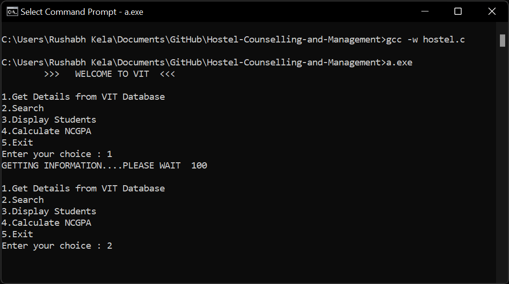
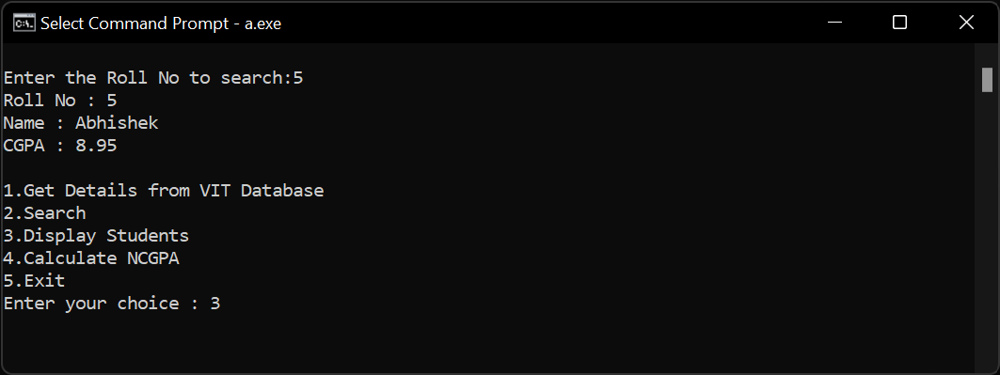
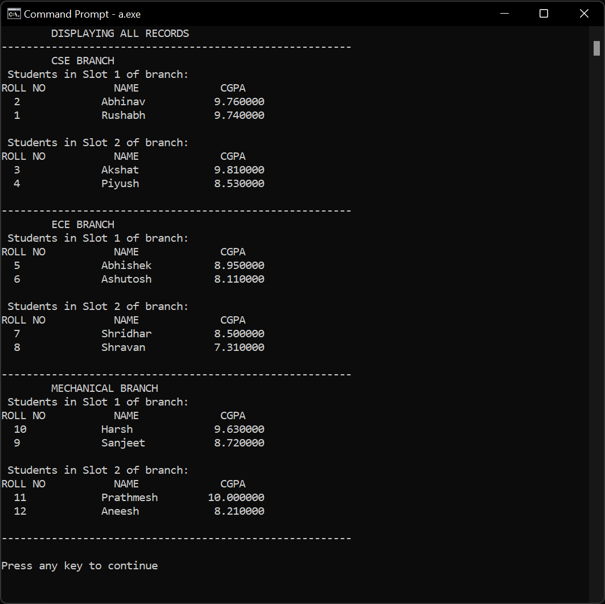
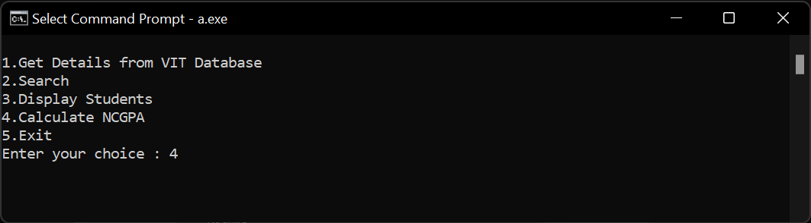
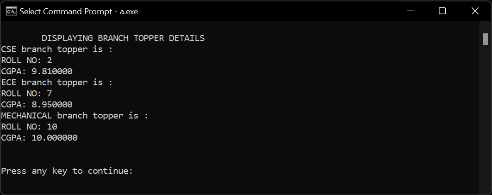
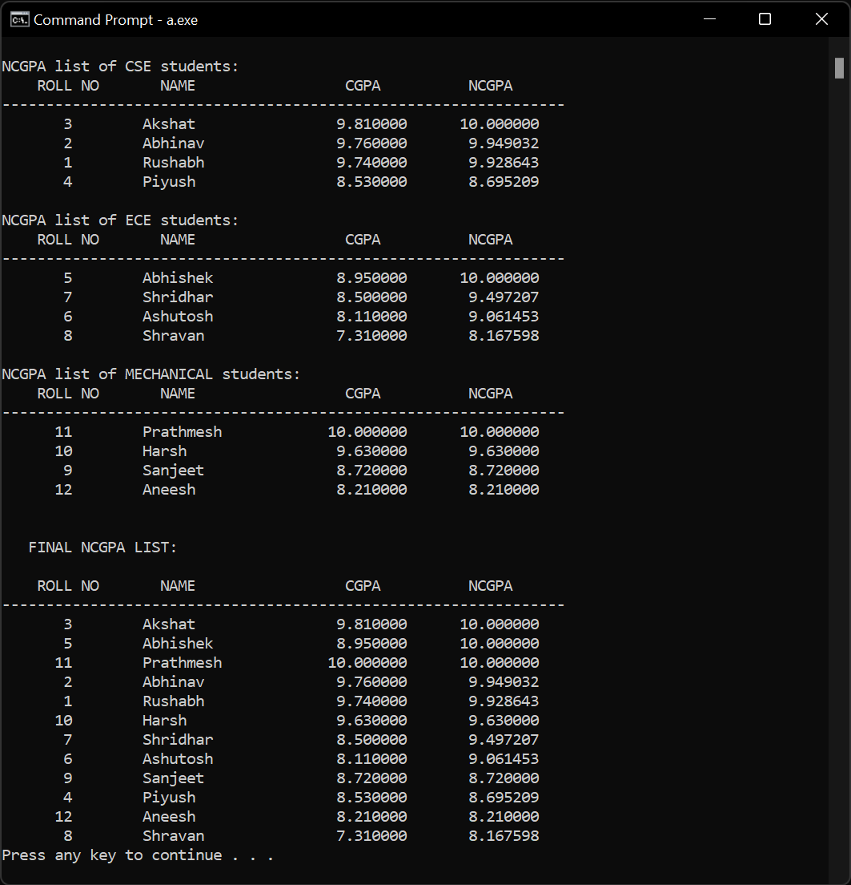
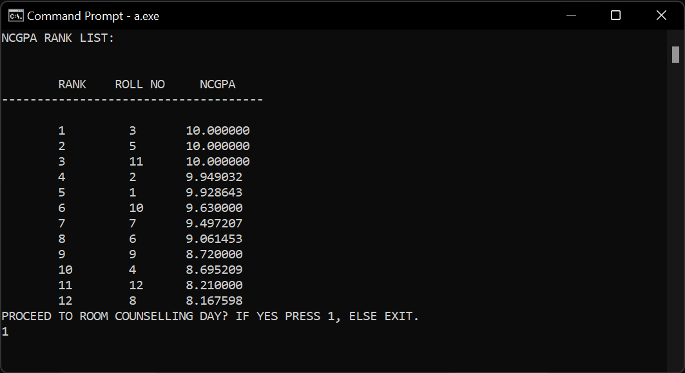
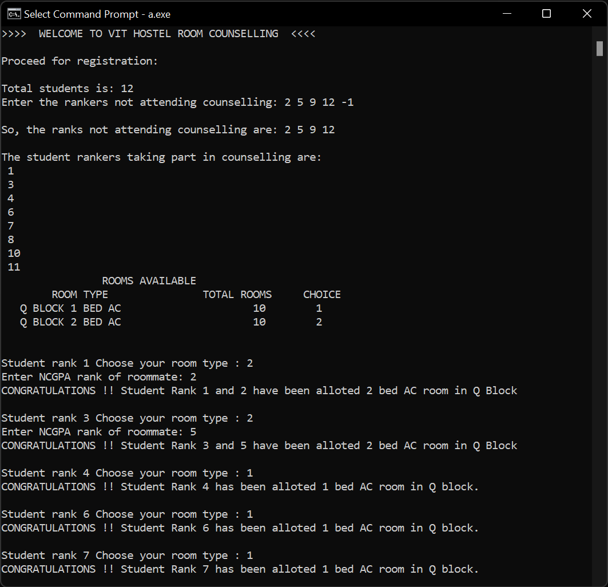
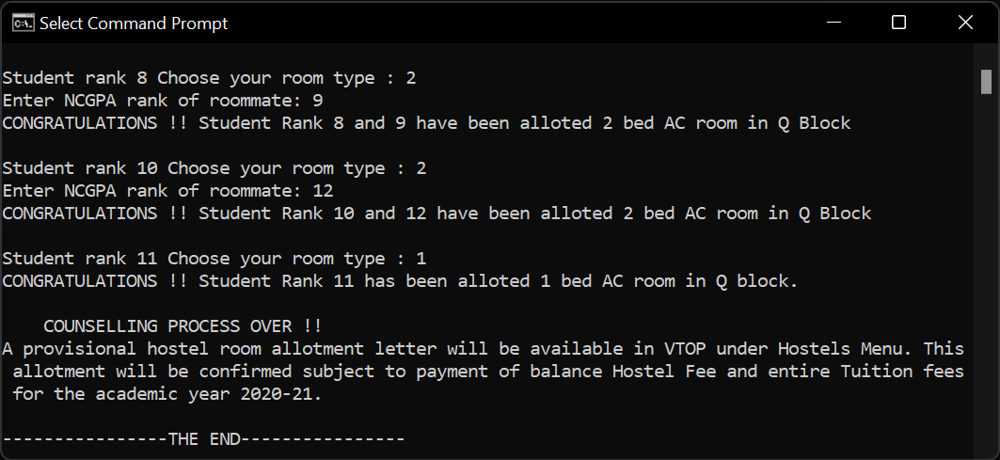

<div id="top"></div>

<br />
<div align="center">
  <h3 align="center">Hostel Counselling and Management</h3>

  <p align="center">
    <br />
    <a href="https://github.com/rushabhkela/Hostel-Counselling-and-Management/blob/main/Report.pdf"><strong>Explore the docs »</strong></a>
    <br />
    <br />
    <a href="https://github.com/rushabhkela/Hostel-Counselling-and-Management/blob/main/hostel.c">View Code</a>
    ·
    <a href="https://youtu.be/Ew6JAtvvED4">View Demo</a>
    ·
    <a href="https://github.com/rushabhkela/Hostel-Counselling-and-Management/pulls">Add a feature</a>
  </p>
</div>


<!-- TABLE OF CONTENTS -->
<details>
  <summary>Table of Contents</summary>
  <ol>
    <li>
      <a href="#about-the-project">About The Project</a>
      <ul>
        <li><a href="#built-with">Built With</a></li>
      </ul>
    </li>
    <li>
      <a href="#getting-started">Getting Started</a>
      <ul>
        <li><a href="#prerequisites">Prerequisites</a></li>
        <li><a href="#running-the-project">Running the Project</a></li>
      </ul>
    </li>
    <li><a href="#usage">Usage</a></li>
    <li><a href="#contributing">Contributing</a></li>
    <li><a href="#license">License</a></li>
    <li><a href="#contact">Contact</a></li>
    <li><a href="#know-more">Know More</a></li>
  </ol>
</details>


<!-- ABOUT THE PROJECT -->
## About The Project

Every year VIT HOSTEL
COUNSELLING is held in the second/third week of
March during the Winter Semester for students’ room
reservation for the ensuing academic year. Room
reservation criteria and rules will be purely based on
the academic performance well as the clean chit
record of students’ discipline as per Code of Conduct,
as practiced every year. Simulation of this project will
involve taking the details of the students as inputs,
then the will be stored in respective branches (such as
CSE, ECE, Mechanical etc.). The desired output shall
be a combined list of students from all branches along
with their NCGPA’s followed by a user – friendly
counselling procedure and room allotments.


<p align="right">(<a href="#top">back to top</a>)</p>


### Built With

This project was built with the following frameworks and technologies:

* [C](https://www.javatpoint.com/c-programming-language-tutorial)


<p align="right">(<a href="#top">back to top</a>)</p>


<!-- GETTING STARTED -->
## Getting Started

Follow the steps given below to run the project on your system.

### Prerequisites

* GCC
  ```sh
  Install GCC Compiler and IDE to run the code.
  Run the following to check if gcc is installed correctly.
  gcc -v 
  ```

### Running the Project

1. Create a file of students with the required details as shown in the metadata.
2. Sample file - [https://github.com/rushabhkela/Hostel-Counselling-and-Management/blob/main/StuDetails.txt](StuDetails.txt)
5. Clone the repo
   ```sh
   git clone https://github.com/rushabhkela/Hostel-Counselling-and-Management.git
   ```
3. Go into the root directory
   ```sh
   cd Hostel-Counselling-and-Management
   ```
4. Run the project
   ```sh
   gcc hostel.c -w
   a.exe
   ```

<p align="right">(<a href="#top">back to top</a>)</p>


<!-- USAGE EXAMPLES -->
## Usage

### Terminal Outputs

<div align="center">
    
      
    
      
    
      
    
      
    
    <br>
</div>


<p align="right">(<a href="#top">back to top</a>)</p>


<!-- CONTRIBUTING -->
## Contributing

Contributions are what make the open source community such an amazing place to learn, inspire, and create. Any contributions you make are **greatly appreciated**.

If you have a suggestion that would make this better, please fork the repo and create a pull request. You can also simply open an issue with the tag "enhancement".
Don't forget to give the project a star! Thanks again!

1. Fork the Project
2. Create your Feature Branch (`git checkout -b feature/AmazingFeature`)
3. Commit your Changes (`git commit -m 'Add some AmazingFeature'`)
4. Push to the Branch (`git push origin feature/AmazingFeature`)
5. Open a Pull Request

<p align="right">(<a href="#top">back to top</a>)</p>


<!-- LICENSE -->
## License

Distributed under the MIT License. See `LICENSE` for more information.

<p align="right">(<a href="#top">back to top</a>)</p>


<!-- CONTACT -->
## Contact

Rushabh Kela - +91 9834473257 - kelarushabh@gmail.com

Project Link: [https://github.com/rushabhkela/Hostel-Counselling-and-Management](https://github.com/rushabhkela/Hostel-Counselling-and-Management)

<p align="right">(<a href="#top">back to top</a>)</p>
